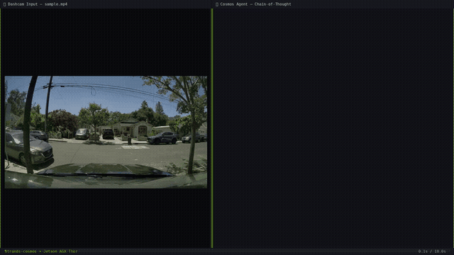

<div align="center">
  <div>
    <a href="https://strandsagents.com">
      <picture>
        <source media="(prefers-color-scheme: dark)" srcset="https://strandsagents.com/latest/assets/wordmark-github-dark.svg">
        
      </picture>
    </a>
  </div>

  <h1>
    Strands Cosmos
  </h1>

  <h2>
    NVIDIA Cosmos for Strands Agents — reason and generate on local compute
  </h2>

  <div align="center">
    <a href="https://pypi.org/project/strands-cosmos/"></a>
    <a href="https://github.com/strands-labs/strands-for-cosmos"></a>
    <a href="https://github.com/strands-labs/strands-for-cosmos/blob/main/LICENSE"></a>
    <a href="https://research.nvidia.com/labs/cosmos-lab/cosmos3/"></a>
    <a href="https://huggingface.co/nvidia/Cosmos-Reason2-2B"></a>
  </div>

  <p>
    <a href="https://strandsagents.com/">Strands Docs</a>
    ◆ <a href="https://strands-labs.github.io/strands-for-cosmos/">Cosmos Docs</a>
    ◆ <a href="https://research.nvidia.com/labs/cosmos-lab/">NVIDIA Cosmos</a>
    ◆ <a href="https://github.com/cagataycali/awesome-strands-agents">Awesome Strands Agents</a>
  </p>
</div>

**NVIDIA Cosmos for [Strands Agents](https://strandsagents.com).** Give your agent eyes that
understand physics and hands that generate video, audio, and robot actions — on local compute.

**4 model providers** (Cosmos 3 omnimodal Reasoner & Generator + Cosmos-Reason2 VLM) and
**45 tools** spanning the full pipeline: reasoning, generation, curation, post-training,
quantization, edge deployment, and evaluation.

---

## ⏱️ Learn it in 90 seconds

**1. Install** (we use [`uv`](https://docs.astral.sh/uv/) everywhere):

```bash
uv pip install strands-cosmos
```

**2. Understand video** - the reasoner reads vision and reasons in text. It talks to a local
vLLM server - see the **Run the reasoner server** dropdown just below to start one, then:

```python
from strands import Agent
from strands_cosmos import Cosmos3ReasonerModel

agent = Agent(model=Cosmos3ReasonerModel(base_url="http://localhost:8000/v1"))
agent("Caption in detail: <video>scene.mp4</video>")
agent("List the notable events with timestamps: <video>scene.mp4</video>")
```

**3. Generate video** - the generator runs in-process (Diffusers, no server):

```python
from strands_cosmos import Cosmos3GeneratorModel

gen = Cosmos3GeneratorModel(model_id="nvidia/Cosmos3-Nano")
gen.generate(mode="text2video",            prompt="A robot navigates a warehouse.", out_path="vid.mp4")
gen.generate(mode="text2video-with-sound", prompt="A robot pours water.",           out_path="av.mp4", enable_sound=True)
gen.generate(mode="image2video",           prompt="It moves forward.", image="frame.jpg", out_path="i2v.mp4")
```

That's the whole loop: **understand → generate.** Everything below is depth - expand only what you need.

| You want to… | Provider | Where |
|--------------|----------|-------|
| Understand video/image (text+vision → text) | `Cosmos3ReasonerModel` | vLLM server |
| Generate image/video/audio/action | `Cosmos3GeneratorModel` | in-process Diffusers |
| Run a tiny VLM on Jetson edge | `CosmosVisionModel`, `CosmosModel` | [Edge VLM](#-cosmos-reason2--lightweight-edge-vlm) |
| Drive the full pipeline from tools | 45 `cosmos*` tools | [Tools](#-tools) |

---

<details>
<summary><b>🚀 Run the reasoner server</b> (one-time setup + serve)</summary>

The reasoner needs a vLLM server. Build a CUDA-matched env and serve `Cosmos3-Nano` on `:8000`:

```bash
just c3-doctor          # check GPU / CUDA / uv / venvs / disk + recommended CUDA pairing
just c3-setup-reason    # build the reasoner venv: vllm + vllm-cosmos3 (uv-managed)
just c3-serve-reason    # serve Cosmos3-Nano on :8000 (--max-model-len 32768)
```

Verify it's up before pointing an agent at it:

```bash
curl -s http://localhost:8000/v1/models    # → {"data":[{"id":"nvidia/Cosmos3-Nano",...}]}
```

Or one-shot a caption straight from the justfile (no Python):

```bash
just c3-reason "Caption in detail." "" scene.mp4 caption
```

> **CUDA pairing:** match torch to your driver - CUDA 13 → `cu130` + `vllm==0.21.0`;
> CUDA 12.8 → `cu128` + `vllm==0.19.1`. `just c3-doctor` reports your driver's recommendation.
>
> **Single-GPU note:** reasoner (vLLM) and generator (Diffusers) each load a 16B model and
> won't co-fit on one ~46GB GPU - stop one before running the other, or use separate GPUs.

</details>

<details>
<summary><b>📦 Install matrix</b> (pick the extra for your task)</summary>

```bash
uv pip install strands-cosmos                  # core: Reason2 VLM + all tools
uv pip install "strands-cosmos[cosmos3]"       # + Cosmos 3 reasoner client (vLLM server)
uv pip install "strands-cosmos[cosmos3-gen]"   # + Cosmos 3 generator (in-proc Diffusers: image/video/sound)
uv pip install "strands-cosmos[vllm]"          # + bundled vLLM + openai client
uv pip install "strands-cosmos[all]"           # everything (heavy)
```

The generator needs the diffusers **dev** build (`Cosmos3OmniPipeline`); PyPI forbids
direct-URL deps, so pin it at install time (or just use `just c3-setup-gen`):

```bash
uv pip install -U "git+https://github.com/huggingface/diffusers.git"
```

| Extra | Pulls in | For |
|-------|----------|-----|
| *(none)* | transformers, torch, torchvision, torchcodec, av | Reason2 VLM + tools |
| `cosmos3` | `openai` | Cosmos 3 reasoner client |
| `cosmos3-gen` | diffusers, cosmos_guardrail, soundfile, imageio | Cosmos 3 generator |
| `vllm` | vllm, openai | self-hosting vLLM |
| `jetson` | torchcodec | Jetson companions (torch via JetPack) |
| `all` | all of the above + dev tools | kitchen sink |

</details>

<details>
<summary><b>🛠️ Developer setup</b> (clone + build everything)</summary>

```bash
git clone https://github.com/cagataycali/strands-cosmos && cd strands-cosmos
just setup-full    # system deps, Python deps, clones all Cosmos repos (uv-managed venvs)
just doctor        # verify everything

# dedicated, CUDA-matched envs (each is its own uv venv):
just c3-setup-reason      # reasoner: vllm + vllm-cosmos3
just c3-setup-gen         # generator: diffusers(main) + cosmos_guardrail
just c3-setup-framework   # action + training: Cosmos Framework
```

Run/lint/test against the dev env via `uv`:

```bash
uv pip install -e ".[dev]"
uv run pytest
uv run ruff check .
```

</details>

<details>
<summary><b>📜 Single-file script with inline deps</b> (PEP 723 + <code>uv run</code>)</summary>

Drop dependencies directly into a script's header - `uv run` builds an ephemeral env, no
manual install. Save as `agent.py`:

```python
# /// script
# requires-python = ">=3.10"
# dependencies = [
#     "strands-agents[openai]",
#     "strands-cosmos",
# ]
# ///
import os, sys
from strands import Agent
from strands_cosmos import Cosmos3ReasonerModel, cosmos3_caption, cosmos3_temporal, video_probe

model = Cosmos3ReasonerModel(base_url=os.environ.get("COSMOS_BASE_URL", "http://localhost:8000/v1"))
agent = Agent(model=model, tools=[cosmos3_caption, cosmos3_temporal, video_probe])
agent(" ".join(sys.argv[1:]) or "Caption in detail: <video>scene.mp4</video>")
```

```bash
uv run agent.py "List the events with timestamps: <video>scene.mp4</video>"
```

</details>

---

## 🌌 Cosmos 3 - Omnimodal World Models

[Cosmos 3](https://research.nvidia.com/labs/cosmos-lab/cosmos3/) is NVIDIA's newest model
family: a unified **Mixture-of-Transformers** that jointly **understands and generates**
text, images, video, audio, and action. strands-cosmos exposes both runtime surfaces -
the **Reasoner** (vLLM, text+vision → text) and the **Generator** (Diffusers, → image/video/audio/action).

<details open>
<summary><b>See it end-to-end: Reason → Generate</b></summary>

Cosmos 3 watches a real construction-site clip, **describes it**, then **generates new
videos** (one with synchronized audio) from its own description - all on a single local GPU.

<table>
<tr>
<th>① Input video</th>
<th>② Cosmos 3 understands it</th>
</tr>
<tr>
<td></td>
<td>

> *"Two construction workers wearing yellow safety vests and helmets are walking away from the camera on a dirt path within a bustling construction site. The ground is covered in loose soil, with visible tire tracks crisscrossing the surface. In the background, a large yellow front-end loader moves slowly across the site, its bucket raised slightly as it navigates the terrain. Behind the loader, partially obscured by rebar and concrete slabs, an excavator operates near a foundation area. The scene is framed by urban buildings in the distance, including a distinctive church-like structure with a tall spire and modern glass-fronted buildings. The overall atmosphere suggests active progress on a significant infrastructure project under clear daylight conditions."*

- `Cosmos3ReasonerModel` (caption in 5.2s)

</td>
</tr>
</table>

The reasoner distills its own understanding into a generation prompt:

> **"Two construction workers in yellow safety vests and helmets walk across a dusty site, gesturing toward a yellow front loader and distant excavator as they converse."**

Then `Cosmos3GeneratorModel` generates similar videos from that prompt (832×480, 49f):

<table>
<tr>
<th>text → video</th>
<th>text → video + 🔊 sound</th>
<th>image → video</th>
</tr>
<tr>
<td></td>
<td></td>
<td></td>
</tr>
<tr>
<td align="center"><sub>55.5s</sub></td>
<td align="center"><sub>43.2s · AAC stereo 48kHz</sub></td>
<td align="center"><sub>42.1s · from a real frame</sub></td>
</tr>
</table>

→ Full demo + MP4s + reasoning: **[`demo/cosmos3_showcase/`](demo/cosmos3_showcase/README.md)** · reproduce with `uv run examples/09_cosmos3_showcase.py`

</details>

<details>
<summary><b>Capabilities & tool map</b></summary>

| Surface | Tools | Backend |
|---------|-------|---------|
| **Reasoner** | `cosmos3_reason`, `cosmos3_caption`, `cosmos3_temporal`, `cosmos3_embodied`, `cosmos3_ground`, `cosmos3_plausibility`, `cosmos3_situation`, `cosmos3_action_cot` | vLLM |
| **Generator** | `cosmos3_text2image`, `cosmos3_text2video`, `cosmos3_image2video`, `cosmos3_text2video_sound` | Diffusers `Cosmos3OmniPipeline` (in-proc) |
| **Video-to-video** | `cosmos3_video2video` (transfer: day→night, recolor, restyle) | vLLM-Omni Docker (`vllm/vllm-omni:cosmos3`) |
| **Action / World-Model** | `cosmos3_forward_dynamics`, `cosmos3_inverse_dynamics`, `cosmos3_policy` | Cosmos Framework (torchrun) |
| **Training (SFT)** | `cosmos3_train`, `cosmos3_train_convert`, `cosmos3_train_show`, `cosmos3_train_export`, … | Cosmos Framework (torchrun) |
| **Servers** | `cosmos3_serve` | start / stop / status |

```bash
just c3-setup-gen       # generator env: diffusers(main) + cosmos_guardrail
just c3-gen text2video "A robot in a warehouse." "" out.mp4

just c3-setup-framework # action + training env: Cosmos Framework
just c3-action spec.jsonl /tmp/out      # forward/inverse dynamics, policy
just c3-train-recipes                   # list SFT recipes
just c3-train vision_sft_nano           # fine-tune (8x H100); see the training guide
```

📖 Full guides: **[Cosmos 3](https://cagataycali.github.io/strands-cosmos/guide/cosmos3/)** · **[Training/SFT](https://cagataycali.github.io/strands-cosmos/guide/cosmos3-training/)**

</details>

<details>
<summary><b>Models</b></summary>

| Model | Size | Capability |
|-------|-----:|------------|
| [Cosmos3-Nano](https://huggingface.co/nvidia/Cosmos3-Nano) | 16B | Omnimodal (reasoner + generator + action) - fits a single ~46GB GPU |
| [Cosmos3-Edge](https://huggingface.co/nvidia/Cosmos3-Edge) | 4B | Omnimodal minus sound; reasoner **in-process** via Transformers (`Cosmos3EdgeHFModel`, 4.6 GB), generator 7.6 GB, action without Cosmos Framework (`cosmos3_action_edge`) — measured on Jetson AGX Thor, see [guide](docs/guide/cosmos3-edge.md) |
| [Cosmos3-Super](https://huggingface.co/nvidia/Cosmos3-Super) | 64B | Frontier-scale (multi-GPU / tensor-parallel) |
| [Cosmos3-Nano-Policy-DROID](https://huggingface.co/nvidia/Cosmos3-Nano-Policy-DROID) | 16B | VL robot policy (DROID) |
| [Cosmos3-Edge-Policy-DROID](https://huggingface.co/nvidia/Cosmos3-Edge-Policy-DROID) | 4B | Edge-size VL robot policy (DROID) |

</details>

---

## 🤖 Cosmos-Reason2 - Lightweight Edge VLM

For edge/Jetson deployments, the Cosmos-Reason2 VLM runs as a Strands model provider
with a tiny footprint - verified on Jetson AGX Thor with Chain-of-Thought reasoning.

```python
from strands import Agent
from strands_cosmos import CosmosVisionModel

agent = Agent(model=CosmosVisionModel(model_id="nvidia/Cosmos-Reason2-2B"))
agent("Caption in detail: <video>dashcam.mp4</video>")                  # video understanding
agent("<image>robot_view.jpg</image> What should the robot do next?")   # image reasoning
agent("What happens when a ball rolls off a table?")                    # text-only physics
```

<details>
<summary><b>Demo, models & performance</b></summary>

> **Dashcam safety analysis with Chain-of-Thought reasoning on Jetson AGX Thor**

<a href="https://github.com/cagataycali/strands-cosmos/releases/download/v0.1.1/strands-cosmos-demo.mp4">
  
</a>

| Model | GPU Memory | Use Case |
|-------|-----------|----------|
| [Cosmos-Reason2-2B](https://huggingface.co/nvidia/Cosmos-Reason2-2B) | 24GB | Edge deployment (Jetson Thor/Orin) |
| [Cosmos-Reason2-8B](https://huggingface.co/nvidia/Cosmos-Reason2-8B) | 32GB | Cloud/desktop high-accuracy |

**Performance (Jetson AGX Thor, Reason2-2B):** text inference **1.4s** (46 tokens) · video caption **2.2s** (short clip @ 4fps), 7s load.

**Jetson install:**

```bash
uv pip install strands-cosmos
strands-cosmos-fix-cublas   # fix CUBLAS for Jetson GPU architecture
```

</details>

---

## 🧰 Tools

Use any of the 45 tools inside a Strands Agent for full-pipeline automation:

```python
from strands import Agent
from strands_cosmos import cosmos_reason_hf, video_probe, cosmos_sysinfo

agent = Agent(tools=[cosmos_reason_hf, video_probe, cosmos_sysinfo])
agent("Check the system, then analyze the video at /tmp/scene.mp4")
```

<details>
<summary><b>Full tool catalog</b> (Reason2 / Predict / Transfer / lifecycle / data / eval)</summary>

| Category | Tools | Description |
|----------|-------|-------------|
| **Reason2 VLM** | `cosmos_inference`, `cosmos_reason_hf`, `cosmos_serve` | TRT server inference, HF direct inference, server lifecycle |
| **Predict 2.5** | `cosmos_predict_generate` | World-model video generation (future frame prediction) |
| **Transfer 2.5** | `cosmos_transfer_generate` | ControlNet video-to-video (depth/edge/sketch→video) |
| **Model Lifecycle** | `cosmos_model_download`, `cosmos_quantize`, `cosmos_export_onnx`, `cosmos_build_engine` | Download, FP8 quantize, ONNX export, TRT engine build |
| **Training** | `cosmos_post_train`, `cosmos_distill` | SFT/LoRA post-training, knowledge distillation |
| **Data** | `cosmos_curate` | Xenna data curation pipeline |
| **Evaluation** | `cosmos_evaluate` | FID/FVD/CSE/CLIP benchmark evaluation |
| **I/O** | `rtp_capture_frame`, `nats_publish`, `video_probe`, `video_extract_frames`, `image_read` | RTP capture, NATS messaging, video/image utilities |
| **System** | `cosmos_sysinfo` | GPU/platform diagnostics |

</details>

---

<details>
<summary><b>⚙️ Configuration</b></summary>

```python
# Cosmos 3 Reasoner
Cosmos3ReasonerModel(base_url="http://localhost:8000/v1", reasoning=True, max_tokens=4096)

# Cosmos 3 Generator
Cosmos3GeneratorModel(model_id="nvidia/Cosmos3-Nano", guardrails=True)

# Cosmos-Reason2 VLM
CosmosVisionModel(
    model_id="nvidia/Cosmos-Reason2-8B",
    reasoning=True,           # Chain-of-thought <think>...</think>
    fps=4,
    params={"max_tokens": 4096, "temperature": 0.6},
)
```

</details>

<details>
<summary><b>🏗️ Architecture</b></summary>

```
strands_cosmos/
├── cosmos3_reasoner_model.py    # Cosmos3ReasonerModel (vLLM, text+vision -> text)
├── cosmos3_generator_model.py   # Cosmos3GeneratorModel (Diffusers, -> image/video/sound)
├── cosmos_vision_model.py       # CosmosVisionModel (Reason2 VLM: video+image+text)
├── cosmos_model.py              # CosmosModel (Reason2 text-only)
├── fix_cublas.py                # Jetson CUBLAS compatibility fix
├── tools/
│   ├── cosmos3.py               # 16 Cosmos 3 tools (reason/generate/action/serve)
│   ├── inference.py · reason_hf.py · serve.py        # Reason2 VLM
│   ├── predict_generate.py · transfer_generate.py    # Predict2.5 / Transfer2.5
│   ├── model_download.py · quantize.py · export_onnx.py · build_engine.py
│   ├── post_train.py · distill.py · curate.py · evaluate.py
│   └── rtp.py · nats_pub.py · video_utils.py · image_read.py · sysinfo.py
└── justfile                     # Developer workflow + c3-* recipes
```

</details>

<details>
<summary><b>✅ Verified platforms</b></summary>

| Platform | GPU | Status |
|----------|-----|--------|
| Desktop / Cloud | NVIDIA L40S / A100 / H100 / RTX 4090 | ✅ Cosmos 3 + Reason2 |
| Jetson AGX Thor | NVIDIA Thor 132GB | ✅ Reason2 (with CUBLAS fix) |
| Jetson Orin | 32/64GB | ✅ Reason2 (may need CUBLAS fix) |

</details>

<details>
<summary><b>🩺 Troubleshooting</b></summary>

**`CUBLAS_STATUS_INVALID_VALUE` on Jetson**
```bash
strands-cosmos-fix-cublas    # replaces torch's bundled CUBLAS with JetPack system CUBLAS
```

**Cosmos 3 reasoner OOM on a single GPU** - the default sequence length (262K) needs a huge
KV cache. `just c3-serve-reason` caps it at `--max-model-len 32768`. Stop the generator before
serving the reasoner (and vice versa).

**`StopIteration` in `get_rope_index` during video (Reason2)** - already handled;
strands-cosmos pins a compatible transformers range. If you still see it:
```bash
uv pip install "transformers>=4.57.0,<5.3.0"
```

**`module 'torchvision.io' has no attribute 'read_video'`** - transformers 5.x decodes video
with `torchcodec` and falls back to torchvision, which removed `io.read_video` in `>=0.27`:
```bash
uv pip install torchcodec
```

**TRT tools return exit 127** - expected on workstations; those run on Jetson or in TRT Docker.
Run `just doctor`.

</details>

---

## Resources

- [Changelog](CHANGELOG.md) - Release history
- [Cosmos 3](https://research.nvidia.com/labs/cosmos-lab/cosmos3/) - Latest omnimodal world models
- [Cosmos Cookbook](https://github.com/nvidia-cosmos/cosmos-cookbook) - Official recipes
- [Cosmos-Reason2](https://github.com/nvidia-cosmos/cosmos-reason2) - VLM source
- [Strands Agents](https://strandsagents.com) - Agent framework

---

## License

Licensed under the [Apache License 2.0](LICENSE). See [NOTICE](NOTICE) for attribution and [SECURITY.md](SECURITY.md) for vulnerability reporting.

Copyright Amazon.com, Inc. or its affiliates. All Rights Reserved. | Built with NVIDIA Cosmos and Strands Agents
