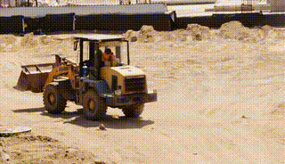

# Cosmos 3 Video-to-Video — Transfer / Variations

`cosmos3_video2video` re-renders an input video with a new prompt while keeping
the scene structure. The **strength** of the transform is controlled by the
conditioning: fewer/earlier clean frames + higher guidance = a stronger change.

All clips below are generated from the **same** construction-site input.

| recolor (teal/orange) | rain storm | crowd of workers | night |
|---|---|---|---|
|  |  |  |  |

```python
from strands_cosmos import cosmos3_video2video

# Strong restyle (default): condition only the first latent, high guidance.
cosmos3_video2video(
    video="input.mp4",
    prompt="Pitch black night, lit only by orange floodlights and headlight beams.",
    negative="day, daylight, sun, bright, blue sky",
    out="night.mp4",
    guidance=12.0, steps=35,
    condition_frames="0", condition_keep="last",
)
```

## Tuning the transform strength

| Want | `condition_frames` | `condition_keep` | `guidance` |
|------|--------------------|------------------|------------|
| Faithful to input (subtle) | `"0,1"` (model default) | `first` | 6 |
| Balanced restyle | `"0"` | `first` | 8 |
| **Strong restyle** (day→night, recolor) | `"0"` | `last` | 9–12 |

Measured on the night transform: input brightness **170** → strong-settings night
**17** (true night with floodlight highlights); the default settings only reached
**148** (barely changed) — hence the stronger defaults baked into the tool.

> Requires the vLLM-Omni server: `just c3-omni-docker` (image `vllm/vllm-omni:cosmos3`).
