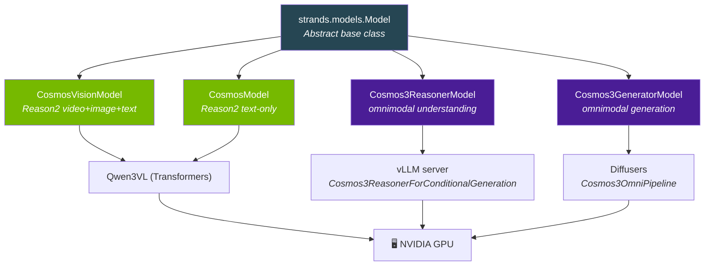
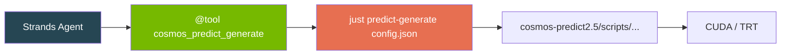
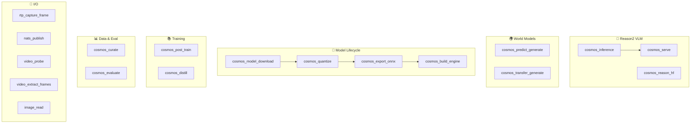
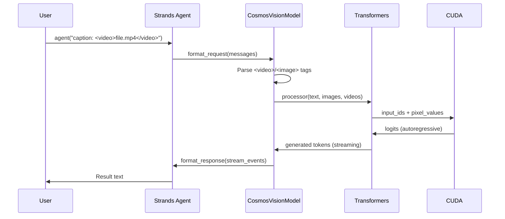
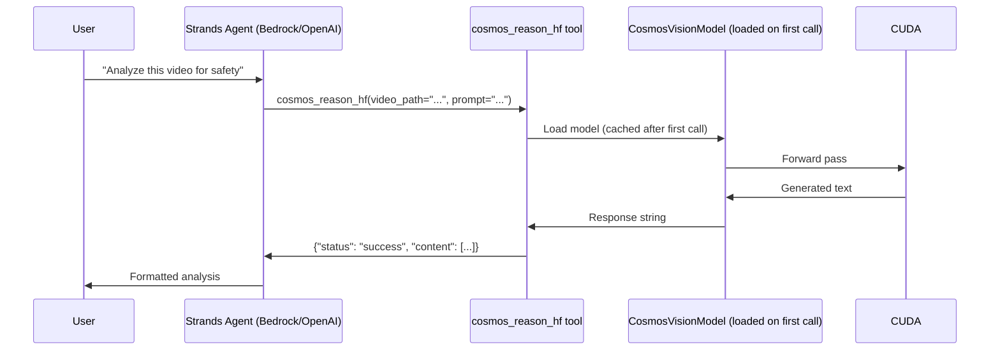
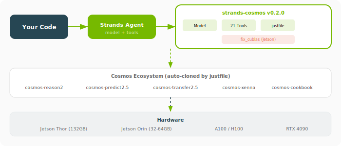
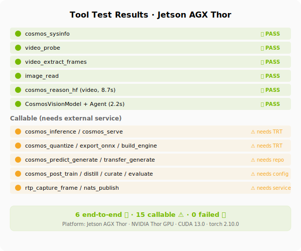

# Architecture

How strands-cosmos is structured internally.

---

## Package Structure

```
strands_cosmos/
├── __init__.py                  # Exports: 4 model providers + 45 tools
├── cosmos_model.py              # Text-only model (Strands Model interface)
├── cosmos_vision_model.py       # Vision model (video + image + text)
│   cosmos3_reasoner_model.py     # Cosmos 3 Reasoner (vLLM, text+vision -> text)
│   cosmos3_generator_model.py    # Cosmos 3 Generator (Diffusers, -> image/video/sound)
├── fix_cublas.py                # Jetson CUBLAS compatibility fix
├── tools/                       # 45 tools covering full Cosmos lifecycle
│   ├── _common.py              # Shared justfile runner utility
│   ├── cosmos3.py             # 16 Cosmos 3 tools (reason/generate/action/serve)
│   ├── inference.py            # TRT server inference
│   ├── reason_hf.py            # HF Transformers direct inference
│   ├── serve.py                # TRT server lifecycle
│   ├── predict_generate.py     # Predict2.5 world model generation
│   ├── transfer_generate.py    # Transfer2.5 ControlNet video-to-video
│   ├── model_download.py       # HF model download
│   ├── quantize.py             # FP8 quantization
│   ├── export_onnx.py          # ONNX export
│   ├── build_engine.py         # TRT engine build
│   ├── post_train.py           # Post-training (SFT/LoRA)
│   ├── distill.py              # Knowledge distillation
│   ├── curate.py               # Xenna data curation
│   ├── evaluate.py             # Benchmark evaluation (FID/FVD/CSE)
│   ├── rtp.py                  # GStreamer RTP frame capture
│   ├── nats_pub.py             # NATS publish
│   ├── video_utils.py          # ffprobe + frame extraction
│   ├── image_read.py           # Base64 image read
│   ├── sysinfo.py              # System/GPU diagnostics
│   ├── cosmos_invoke.py        # Legacy text tool
│   └── cosmos_vision_invoke.py # Legacy vision tool
└── justfile                     # Developer workflow automation (recipes)
```

---

## Model Hierarchy



---

## Tool Architecture

All tools follow a common pattern: thin Python wrappers that delegate to `just <recipe>` commands from the justfile. This ensures:

- **Reproducibility**: every tool invocation maps to a concrete shell command
- **Composability**: tools can be combined by an agent in any order
- **Platform awareness**: justfile recipes handle OS/GPU detection



### Tool Categories



---

## Data Flow (Model Mode)



---

## Data Flow (Tool Mode)



---

## Justfile Integration

The justfile serves as the glue between Python tools and the Cosmos ecosystem repos:

```
┌─────────────────────────────────┐
│  Strands Agent  +  Python Tools │
└─────────────┬───────────────────┘
              │ subprocess("just <recipe> ...")
              ▼
┌─────────────────────────────────┐
│         justfile (recipes)       │
├─────────────────────────────────┤
│ • setup / doctor / install      │
│ • predict-generate / transfer   │
│ • quantize / export / build     │
│ • serve-start / serve-stop      │
│ • post-train / distill          │
│ • evaluate / curate             │
└─────────────┬───────────────────┘
              │ calls scripts in:
              ▼
┌─────────────────────────────────┐
│    Cosmos Ecosystem Repos        │
│ • cosmos-predict2.5              │
│ • cosmos-transfer2.5             │
│ • cosmos-reason2                 │
│ • cosmos-xenna                   │
│ • cosmos-rl                      │
│ • cosmos-cookbook                 │
└─────────────────────────────────┘
```

---

## Strands Model Interface

`CosmosVisionModel` implements the full [Strands Model interface](https://strandsagents.com):

| Method | Purpose |
|--------|---------|
| `update_config()` | Merge user config |
| `get_config()` | Return current config |
| `format_request()` | Convert messages → HF inputs |
| `format_chunk()` | Stream tokens → StreamEvents |
| `format_response()` | Finalize response metadata |

---

## Configuration

```python
CosmosVisionModel(
    model_id="nvidia/Cosmos-Reason2-2B",
    device_map="auto",
    torch_dtype="auto",
    fps=4,
    min_vision_tokens=256,
    max_vision_tokens=8192,
    reasoning=True,
    params={"max_tokens": 4096, "temperature": 0.6, "top_p": 0.95},
)
```

---

## Visual Overview

### Pipeline


### Architecture Layers


### Tool Test Status (Jetson AGX Thor)

