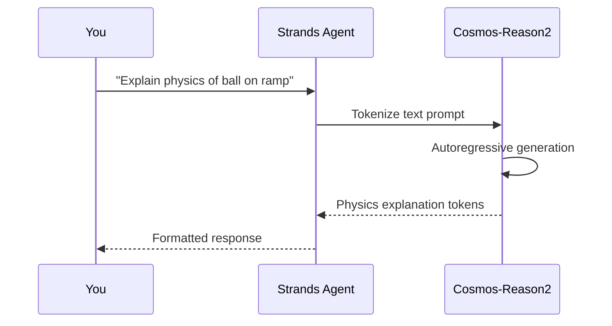

# Basic Text — Physics Reasoning

Text-only inference with Cosmos-Reason2. No video or image needed — pure physical world reasoning.

---

## Terminal Recording


<details>
<summary>📺 Can't see the animation? <a href="/strands-cosmos/assets/videos/01_basic_text.mp4">Download MP4</a></summary>

<video controls width="100%" muted>
  <source src="/strands-cosmos/assets/videos/01_basic_text.mp4" type="video/mp4">
</video>

</details>

??? example "View output text"
    ```
    $ python examples/01_basic_text.py
    === 01: Basic Text Inference ===
    Loading nvidia/Cosmos-Reason2-2B... ✅ loaded

    Agent: When a ball rolls down a ramp, several physics principles are at work:

    1. Gravitational Potential Energy → Kinetic Energy
       The ball at the top has PE = mgh. As it descends,
       gravity converts this to KE = ½mv².

    2. Rolling Without Slipping
       Static friction at the contact point causes the ball
       to rotate rather than slide.

    3. Moment of Inertia
       For a solid sphere: I = (2/5)mr². ~71% of energy goes
       to translation, ~29% to rotation.

    4. Acceleration
       a = (5/7)g·sin(θ), less than a sliding block.

    Time: 11.2s
    === PASS ===
    ```

Play locally: `asciinema play docs/assets/casts/01_basic_text.cast`

---

## Code

```python title="examples/01_basic_text.py"
from strands import Agent
from strands_cosmos import CosmosModel

model = CosmosModel(model_id="nvidia/Cosmos-Reason2-2B")
agent = Agent(model=model)

result = agent("Explain the physics of a ball rolling down a ramp. Be concise.")
```

## How It Works



## Key Points

- Uses `CosmosModel` (text-only) — lighter than vision model
- No GPU memory needed for vision encoder
- Good for physics reasoning, causal inference, knowledge queries
- ~11s on Jetson AGX Thor

!!! tip "When to use CosmosModel vs CosmosVisionModel"
    Use `CosmosModel` for text-only tasks. It loads faster and uses less memory. Use `CosmosVisionModel` when you need video or image input.

---

→ **Next:** [Video Captioning](video-caption.md) | [All Examples](overview.md)
