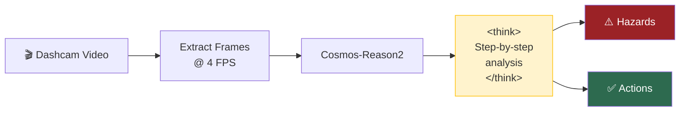

# Driving Analysis with Chain-of-Thought

Autonomous driving safety analysis using dashcam video with step-by-step reasoning.

---

## Terminal Recording


<details>
<summary>📺 Can't see the animation? <a href="/strands-cosmos/assets/videos/03_driving_analysis.mp4">Download MP4</a></summary>

<video controls width="100%" muted>
  <source src="/strands-cosmos/assets/videos/03_driving_analysis.mp4" type="video/mp4">
</video>

</details>

??? example "View full output"
    ```
    $ python examples/03_driving_analysis.py
    === 03: Driving Analysis (CoT) ===
    Loading nvidia/Cosmos-Reason2-2B (vision, reasoning=True)... ✅ loaded
    Processing video: sample.mp4 @ 4 FPS... 40 frames

    Agent:
    <think>
    Let me analyze this dashcam footage step by step.

    First, key elements:
    - Suburban residential street
    - Multiple parked vehicles on both sides
    - A pedestrian on the right sidewalk
    - Trees creating partial shade
    - Road appears dry, good visibility

    Potential hazards:
    1. Pedestrian could step into the road
    2. Car could open a door from parked vehicles
    3. Limited visibility at upcoming intersection
    4. Children might be playing behind parked cars
    </think>

    ⚠️  Safety Hazards:
    • Pedestrian on right sidewalk — risk of jaywalking
    • Parked cars on both sides — door opening risk
    • Upcoming intersection — limited cross-traffic visibility

    ✅ Recommended Actions:
    • Maintain ≤25 mph through residential zone
    • Stay center-lane, avoid door zone
    • Watch for pedestrian course changes
    • Slow to 15 mph approaching intersection

    Time: 16.4s
    === PASS ===
    ```

Play locally: `asciinema play docs/assets/casts/03_driving_analysis.cast`

---

## Code

```python title="examples/03_driving_analysis.py"
from strands import Agent
from strands_cosmos import CosmosVisionModel

model = CosmosVisionModel(
    model_id="nvidia/Cosmos-Reason2-2B",
    reasoning=True,                           # Enable <think> CoT
    fps=4,
    params={"max_tokens": 2048, "temperature": 0.6},
)
agent = Agent(model=model)

result = agent(
    "<video>sample.mp4</video> "
    "Identify safety hazards and recommend actions."
)
```

## Chain-of-Thought Flow



## Why Chain-of-Thought Matters for Driving

Without CoT, the model might miss subtle hazards. With `reasoning=True`:

| Aspect | Without CoT | With CoT |
|--------|------------|----------|
| **Output** | Direct answer | Reasoning → Answer |
| **Hazard detection** | Obvious only | Subtle + obvious |
| **Confidence** | "Be careful" | Specific actions with rationale |
| **Token count** | ~200 | ~600 |
| **Inference time** | ~8s | ~16s |

!!! example "Built-in driving prompt"
    Cosmos includes an optimized driving analysis prompt:
    ```python
    from strands_cosmos.cosmos_vision_model import TASK_PROMPTS
    print(TASK_PROMPTS["driving"])
    # "The video depicts the observation from the vehicle's camera.
    #  You need to think step by step and identify the objects in
    #  the scene that are critical for safe navigation."
    ```

## Use Cases

- **Fleet safety monitoring** — Automated dashcam review
- **ADAS development** — Scene understanding for driver assistance
- **Insurance analysis** — Incident reconstruction from video
- **Driving instruction** — Identify learning moments in student footage
- **Autonomous vehicle testing** — Perception validation

---

→ **Next:** [Embodied Reasoning](embodied.md) | [All Examples](overview.md)
