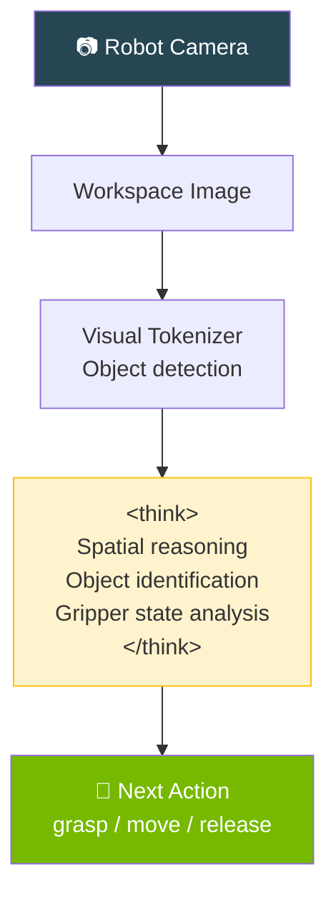
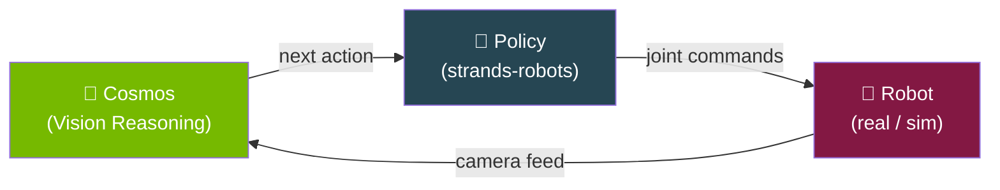

# Embodied Reasoning — Robot Vision

Robot next-action prediction from workspace images using chain-of-thought reasoning.

---

## Terminal Recording


<details>
<summary>📺 Can't see the animation? <a href="/strands-cosmos/assets/videos/04_embodied_reasoning.mp4">Download MP4</a></summary>

<video controls width="100%" muted>
  <source src="/strands-cosmos/assets/videos/04_embodied_reasoning.mp4" type="video/mp4">
</video>

</details>

??? example "View full output"
    ```
    $ python examples/04_embodied_reasoning.py
    === 04: Embodied Reasoning ===
    Loading nvidia/Cosmos-Reason2-2B (vision, reasoning=True)... ✅ loaded
    Processing image: sample.png

    Agent:
    <think>
    I see a bimanual robot workspace from a top-down camera view.

    In the workspace I can identify:
    - A red cube near the center of the table
    - A blue bin on the right side
    - The robot's left gripper is open and positioned
      approximately 10cm above the red cube
    - The right gripper is in a neutral position

    Given the spatial layout, the most logical next action
    is to lower the left gripper to grasp the red cube.
    </think>

    The robot should lower the left gripper to grasp the red cube.
    Steps: descend → close gripper → lift → move to blue bin → release.

    Time: 43.1s
    === PASS ===
    ```

Play locally: `asciinema play docs/assets/casts/04_embodied_reasoning.cast`

---

## Code

```python title="examples/04_embodied_reasoning.py"
from strands import Agent
from strands_cosmos import CosmosVisionModel

model = CosmosVisionModel(
    model_id="nvidia/Cosmos-Reason2-2B",
    reasoning=True,
    params={"max_tokens": 2048, "temperature": 0.6},
)
agent = Agent(model=model)

result = agent(
    "<image>sample.png</image> "
    "What can be the next immediate action?"
)
```

## Robot Vision Pipeline



## Built-in Task Prompts for Robotics

```python
from strands_cosmos.cosmos_vision_model import TASK_PROMPTS

# Next-action prediction
TASK_PROMPTS["embodied_reasoning"]
# → "What can be the next immediate action?"

# Step-by-step robot planning with trajectory
TASK_PROMPTS["robot_cot"]
# → 'You are given the task "{task_instruction}". Specify
#    the 2D trajectory your end effector should follow...'

# 2D object grounding
TASK_PROMPTS["2d_grounding"]
# → 'Locate the bounding box of {object_name}. Return a json.'
```

## Capabilities

| Task | Description | Example |
|------|-------------|---------|
| **Next-action** | What should the robot do right now? | Grasp, move, release |
| **Spatial reasoning** | Where are objects relative to gripper? | "10cm above the cube" |
| **Trajectory planning** | 2D pixel path for end effector | JSON coordinates |
| **Object grounding** | Bounding boxes for named objects | `{"x": 120, "y": 80, "w": 40, "h": 40}` |
| **Scene understanding** | Full workspace description | Objects, tools, layout |

## Integration with Robot Control



!!! tip "Combine with strands-robots"
    Use Cosmos for high-level reasoning and [strands-robots](https://github.com/cagataycali/strands-gtc-case-study) for low-level robot control:
    ```python
    from strands import Agent
    from strands_cosmos import cosmos_vision_invoke
    from strands_robots import Robot

    # Cosmos reasons about what to do
    # strands-robots executes the action
    agent = Agent(tools=[cosmos_vision_invoke])
    ```

---

→ **Next:** [Tool Usage](tool-usage.md) | [All Examples](overview.md)
