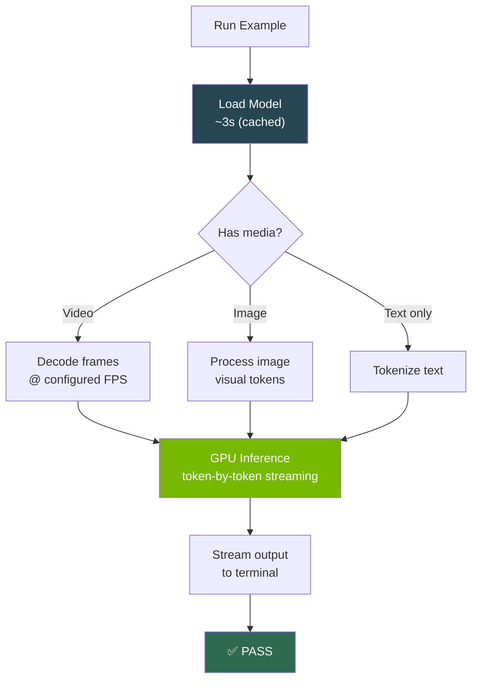

# Examples

!!! tip "New here? Start with the notebooks"
    These scripts are the runnable distillation of the
    **[interactive notebooks](../notebooks.md)** — learn the concept step by step
    in a notebook, then ship it from `examples/`.

Runnable examples tested on NVIDIA Jetson AGX Thor (132GB unified memory).

---

## Demo Video

<a href="https://github.com/cagataycali/strands-cosmos/releases/download/v0.1.1/strands-cosmos-demo.mp4">
  
</a>

> *Click to watch the full demo video*

---

## All Examples

<div class="grid cards" markdown>

- **01 — Basic Text (Physics Reasoning)**

    

    Text-only physics reasoning — no video or image needed. ~11s on Thor.

    → [Full example + code](basic-text.md)

- **02 — Video Captioning**

    

    Detailed temporal-spatial descriptions from video. ~15s on Thor.

    → [Full example + code](video-caption.md)

- **03 — Driving Analysis (CoT)**

    

    Dashcam safety analysis with chain-of-thought reasoning. ~16s on Thor.

    → [Full example + code](driving.md)

- **04 — Embodied Reasoning**

    

    Robot next-action prediction from workspace images. ~43s on Thor.

    → [Full example + code](embodied.md)

- **05 — Tool Usage**

    

    Cosmos as a callable tool inside any Strands agent. ~9s on Thor.

    → [Full example + code](tool-usage.md)

- **06 — Cosmos 3 Reasoner**

    Omnimodal video/image understanding via local vLLM — caption, temporal, embodied, grounding.

    → `examples/06_cosmos3_reason.py` · [Cosmos 3 Guide](../guide/cosmos3.md)

- **07 — Cosmos 3 Generator**

    Text → image / video / **video + sound** (in-process Diffusers).

    → `examples/07_cosmos3_generate.py`

- **08 — Cosmos 3 Action**

    World-model rollouts: forward/inverse dynamics, policy (Cosmos Framework).

    → `examples/08_cosmos3_action.py`

- **09 — Cosmos 3 Showcase (Reason → Generate)**

    

    Reason about a real video, then generate similar videos (incl. audio) from the description.

    → `examples/09_cosmos3_showcase.py` · [demo/cosmos3_showcase/](https://github.com/cagataycali/strands-cosmos/tree/main/demo/cosmos3_showcase)

</div>

---

## Quick Reference

| # | Example | Time (Thor) | Recording |
|---|---------|-------------|-----------|
| 1 | [Basic Text](basic-text.md) | ~11s | [:material-play: cast](../assets/casts/01_basic_text.cast) |
| 2 | [Video Caption](video-caption.md) | ~15s | [:material-play: cast](../assets/casts/02_video_caption.cast) |
| 3 | [Driving Analysis](driving.md) | ~16s | [:material-play: cast](../assets/casts/03_driving_analysis.cast) |
| 4 | [Embodied Reasoning](embodied.md) | ~43s | [:material-play: cast](../assets/casts/04_embodied_reasoning.cast) |
| 5 | [Tool Usage](tool-usage.md) | ~9s | [:material-play: cast](../assets/casts/05_tool_usage.cast) |
| 6 | Cosmos 3 Reasoner (vLLM) | caption ~5s | — |
| 7 | Cosmos 3 Generator (Diffusers) | t2v ~20–55s | — |
| 8 | Cosmos 3 Action (Framework) | rollout ~30s | — |
| 9 | Cosmos 3 Showcase (reason→generate) | full loop | — |

---

## Running Locally

```bash
git clone https://github.com/cagataycali/strands-cosmos.git
cd strands-cosmos
pip install -e .

# Jetson devices: fix CUBLAS first
strands-cosmos-fix-cublas

# Run any example
python examples/01_basic_text.py
python examples/02_video_caption.py
python examples/03_driving_analysis.py
python examples/04_embodied_reasoning.py
python examples/05_tool_usage.py

# Cosmos 3 (see the Cosmos 3 Guide for env setup: just c3-setup-reason / c3-setup-gen)
python examples/06_cosmos3_reason.py       # needs `just c3-serve-reason` running
python examples/07_cosmos3_generate.py     # needs `just c3-setup-gen`
python examples/09_cosmos3_showcase.py     # reason -> generate showcase
```

!!! note "Sample media"
    Examples 02–05 need a `sample.mp4` (video) and/or `sample.png` (image) in the project root. Set paths via environment variables:
    ```bash
    export SAMPLE_VIDEO=/path/to/your/video.mp4
    export SAMPLE_IMAGE=/path/to/your/image.png
    ```

## Playing Terminal Recordings

All examples have asciinema `.cast` recordings:

```bash
pip install asciinema

# Play any recording
asciinema play docs/assets/casts/01_basic_text.cast
asciinema play docs/assets/casts/03_driving_analysis.cast
```

---

## Execution Flow


