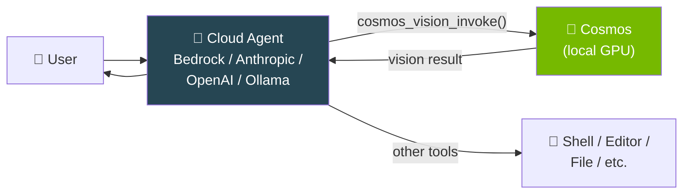
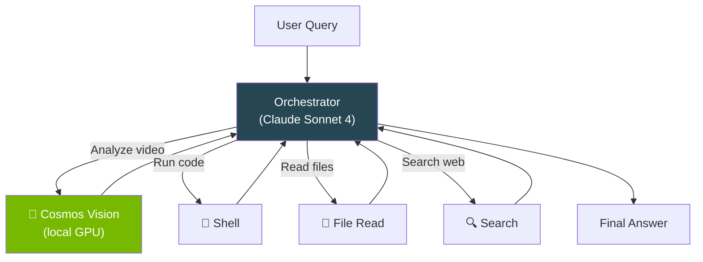

# Tool Usage — Cosmos Inside Another Agent

Use Cosmos as a callable **tool** inside any Strands agent (Bedrock, Anthropic, OpenAI, Ollama, etc.).

---

## Terminal Recording


<details>
<summary>📺 Can't see the animation? <a href="/strands-cosmos/assets/videos/05_tool_usage.mp4">Download MP4</a></summary>

<video controls width="100%" muted>
  <source src="/strands-cosmos/assets/videos/05_tool_usage.mp4" type="video/mp4">
</video>

</details>

??? example "View full output"
    ```
    $ python examples/05_tool_usage.py
    === 05: Tool Usage (direct invoke) ===
    Loading cosmos_vision_invoke tool... ✅ loaded
    Processing video: sample.mp4

    Status: success
    Response: The scene shows a vehicle driving through a quiet
    residential neighborhood. Parked cars line both sides...

    Time: 8.7s
    === PASS ===
    ```

Play locally: `asciinema play docs/assets/casts/05_tool_usage.cast`

---

## Architecture



The orchestrating agent (cloud or local) decides **when** to call Cosmos. Cosmos runs **locally on your GPU** for vision inference. Results flow back.

---

## Direct Tool Invocation

```python title="examples/05_tool_usage.py"
from strands_cosmos import cosmos_vision_invoke

# Direct call — no outer agent needed
result = cosmos_vision_invoke(
    prompt="Describe the scene briefly.",
    video_path="sample.mp4",
    max_tokens=512,
)

print(result["status"])        # "success"
print(result["content"][0]["text"])  # Scene description
```

## As a Tool Inside Another Agent

```python
from strands import Agent
from strands_cosmos import cosmos_vision_invoke

# Cosmos becomes a tool inside a Claude / GPT-4 agent
agent = Agent(tools=[cosmos_vision_invoke])
agent("Analyze this dashcam video for safety: /path/to/video.mp4")
```

## Both Tools Together

```python
from strands import Agent
from strands_cosmos import cosmos_invoke, cosmos_vision_invoke

agent = Agent(tools=[cosmos_invoke, cosmos_vision_invoke])

# The agent automatically picks the right tool
agent("What happens in this video? /path/to/clip.mp4")  # → vision tool
agent("Explain Newton's third law")                       # → text tool
```

## Tool Parameters

### `cosmos_vision_invoke`

| Parameter | Type | Default | Description |
|-----------|------|---------|-------------|
| `prompt` | `str` | required | Question about the media |
| `video_path` | `str` | `""` | Path to video file |
| `image_path` | `str` | `""` | Path to image file |
| `model_id` | `str` | `nvidia/Cosmos-Reason2-2B` | Model to use |
| `reasoning` | `bool` | `False` | Enable chain-of-thought |
| `task` | `str` | `""` | Built-in task prompt key |
| `fps` | `float` | `4.0` | Video frame rate |
| `max_tokens` | `int` | `4096` | Maximum output tokens |

### `cosmos_invoke`

| Parameter | Type | Default | Description |
|-----------|------|---------|-------------|
| `prompt` | `str` | required | Text prompt |
| `model_id` | `str` | `nvidia/Cosmos-Reason2-2B` | Model to use |
| `reasoning` | `bool` | `False` | Enable chain-of-thought |
| `max_tokens` | `int` | `4096` | Maximum output tokens |

## Multi-Agent Architecture



!!! tip "Model caching"
    The Cosmos model is loaded once and cached globally. Subsequent tool calls reuse the loaded model — no re-loading penalty.

---

→ **Back to:** [All Examples](overview.md)
