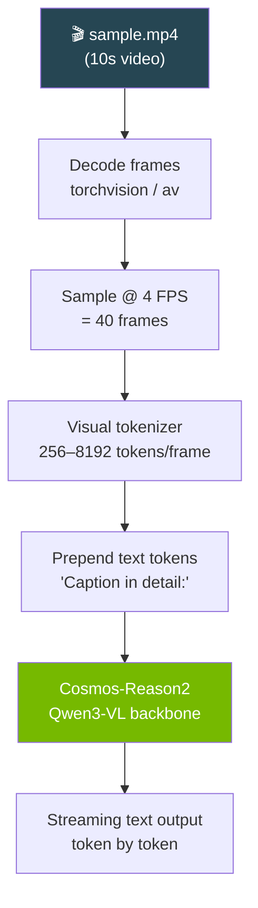

# Video Captioning

Detailed temporal-spatial descriptions of video content using Cosmos-Reason2.

---

## Terminal Recording


<details>
<summary>📺 Can't see the animation? <a href="/strands-cosmos/assets/videos/02_video_caption.mp4">Download MP4</a></summary>

<video controls width="100%" muted>
  <source src="/strands-cosmos/assets/videos/02_video_caption.mp4" type="video/mp4">
</video>

</details>

??? example "View output text"
    ```
    $ python examples/02_video_caption.py
    === 02: Video Caption ===
    Loading nvidia/Cosmos-Reason2-2B (vision)... ✅ loaded
    Processing video: sample.mp4 @ 4 FPS... 40 frames

    Agent: The video shows a suburban residential street filmed from a
    forward-facing dashcam. At the beginning, the vehicle is stationary
    at an intersection. Several parked cars line both sides...

    A pedestrian is visible on the right sidewalk. No oncoming traffic.
    The speed limit sign shows 25 mph.

    Time: 14.8s
    === PASS ===
    ```

Play locally: `asciinema play docs/assets/casts/02_video_caption.cast`

---

## Code

```python title="examples/02_video_caption.py"
from strands import Agent
from strands_cosmos import CosmosVisionModel

model = CosmosVisionModel(
    model_id="nvidia/Cosmos-Reason2-2B",
    fps=4,
    params={"max_tokens": 4096},
)
agent = Agent(model=model)

result = agent("Caption in detail: <video>sample.mp4</video>")
```

## Video Processing Pipeline



## FPS Configuration Guide

| FPS | Frames (10s) | Memory | Speed | Best For |
|-----|-------------|--------|-------|----------|
| 1 | 10 | Low | Fast | Quick summaries |
| **4** | **40** | **Medium** | **Balanced** | **Default — most tasks** |
| 8 | 80 | High | Slow | Frame-level detail |

```python
# Quick summary
model = CosmosVisionModel(fps=1)

# Detailed analysis
model = CosmosVisionModel(fps=8)
```

## Supported Video Formats

| Format | Container | Status |
|--------|-----------|--------|
| H.264 | .mp4 | ✅ Primary |
| H.265 | .mp4 | ✅ |
| VP9 | .webm | ✅ |
| AV1 | .mp4 | ⚠️ Needs torchcodec |

!!! note "Video length"
    Longer videos use more GPU memory (more frames × tokens). For videos >60s, consider reducing `fps` or splitting into segments.

---

→ **Next:** [Driving Analysis](driving.md) | [All Examples](overview.md)
