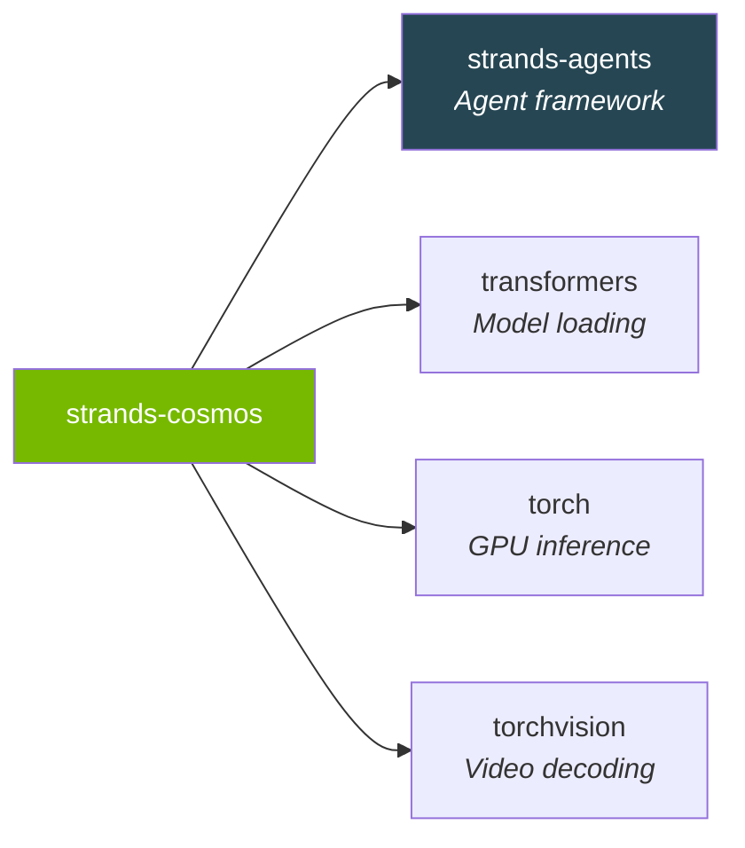

# Installation

## Requirements

- Python ≥ 3.10
- NVIDIA GPU (24 GB+ for 2B model, 32 GB+ for 8B model)
- CUDA 12.x

## Install

```bash
pip install strands-cosmos
```

!!! tip "zsh users"
    If you see `zsh: no matches found`, quote the package name: `pip install "strands-cosmos"`

## Platform Compatibility

| Platform | GPU | Status |
|----------|-----|--------|
| Desktop Linux x86_64 | A100 / H100 / RTX 4090 | ✅ |
| Jetson AGX Thor | Thor 132 GB | ✅ (with CUBLAS fix) |
| Jetson Orin | Orin 32/64 GB | ✅ (may need CUBLAS fix) |
| macOS (Apple Silicon) | ❌ | No CUDA — use [strands-mlx](https://github.com/cagataycali/strands-mlx) |

## Jetson Setup

On NVIDIA Jetson devices, PyTorch's pip-bundled CUBLAS may not support the GPU architecture. Run the included fix after install:

```bash
# Fix CUBLAS (auto-detects if needed, safe on any platform)
strands-cosmos-fix-cublas

# Or check without fixing:
strands-cosmos-fix-cublas --check

# Revert if needed:
strands-cosmos-fix-cublas --revert
```

→ See [Jetson Deployment Guide](../guide/jetson.md) for details.

## Verify

```python
from strands_cosmos import CosmosVisionModel

model = CosmosVisionModel(model_id="nvidia/Cosmos-Reason2-2B")
print("✅ Model loaded successfully")
```

!!! note "First run"
    The first run downloads the model from HuggingFace (~5 GB for 2B). Subsequent runs load from cache.

## What Gets Installed



## Cosmos 3 Environments (optional)

`pip install strands-cosmos` is all you need for the **Cosmos-Reason2** VLM. The
**Cosmos 3** omnimodal models use dedicated, uv-managed environments because their
backends (vLLM / Diffusers / Cosmos Framework) pin CUDA-specific builds:

```bash
# Generator extras via pip (Diffusers + cosmos_guardrail + soundfile):
pip install "strands-cosmos[cosmos3-gen]"

# Or build dedicated, CUDA-matched venvs with the justfile:
git clone https://github.com/cagataycali/strands-cosmos && cd strands-cosmos
just c3-doctor          # reports GPU, driver CUDA, and the torch-backend pairing to use
just c3-setup-reason    # Reasoner: vllm + vllm-cosmos3
just c3-setup-gen       # Generator: diffusers(main) + cosmos_guardrail + soundfile
just c3-setup-framework # Action / world-model: Cosmos Framework (optional)
```

!!! warning "CUDA pairing"
    The torch backend must match your driver — CUDA 13 → `cu130` + `vllm==0.21.0`;
    CUDA 12.8 → `cu128` + `vllm==0.19.1`. `just c3-doctor` prints the recommendation.

See the **[Cosmos 3 Guide](../guide/cosmos3.md)** for full setup and usage.

---

## What's Next

- [**Quickstart**](quickstart.md) — Your first Cosmos agent in 5 lines
- [**Video Understanding**](../guide/video-understanding.md) — Process dashcam, robot, and scene videos
- [**Jetson Deployment**](../guide/jetson.md) — Run on edge hardware
- [**Cosmos 3 Guide**](../guide/cosmos3.md) — Omnimodal reasoning + generation
