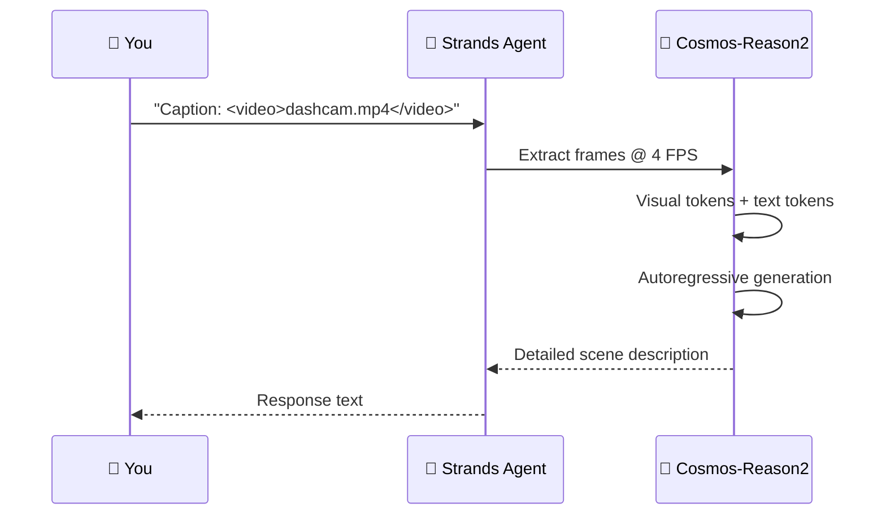
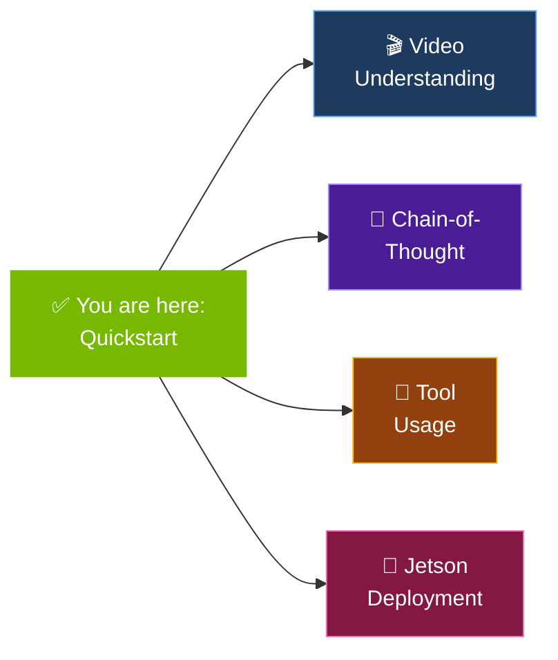

# Quickstart

!!! tip "Prefer learning by doing?"
    Every concept below is also an **interactive notebook** with color-coded
    diagrams — and they run safely even without a GPU. See **[Notebooks](../notebooks.md)**,
    starting with `notebooks/00_start_here.ipynb`.

Get from zero to a running Cosmos agent in under 2 minutes.

---

## The Journey


## Install

```bash
pip install strands-cosmos
```

## Choose your path

| Goal | Use | Jump to |
|------|-----|---------|
| Understand **and generate** video/audio/action (latest) | **Cosmos 3** | [Cosmos 3 quickstart](#cosmos-3-reason-generate) |
| Lightweight edge VLM (Jetson) | **Cosmos-Reason2** | [Reason2 quickstart](#1-text-only-physics-reasoning) |

---

## Cosmos 3: Reason → Generate

[Cosmos 3](https://research.nvidia.com/labs/cosmos-lab/cosmos3/) is NVIDIA's newest
omnimodal world model — one model that **understands** video/image and **generates**
image, video, audio, and robot actions. See the full **[Cosmos 3 Guide](../guide/cosmos3.md)**.

### Setup (one-time)

```bash
just c3-doctor          # check GPU / CUDA / uv + recommended torch backend pairing
just c3-setup-reason    # Reasoner env: vllm + vllm-cosmos3
just c3-setup-gen       # Generator env: diffusers + cosmos_guardrail + soundfile
```

Or install the generator extras via pip:

```bash
pip install "strands-cosmos[cosmos3-gen]"   # Diffusers + cosmos_guardrail + soundfile
```

### Reason about a video

```bash
just c3-serve-reason    # serve Cosmos3-Nano on :8000 (first run downloads the 16B model)
```

```python
from strands import Agent
from strands_cosmos import Cosmos3ReasonerModel

agent = Agent(model=Cosmos3ReasonerModel(base_url="http://localhost:8000/v1"))
agent("Caption in detail: <video>scene.mp4</video>")
agent("List the notable events with timestamps: <video>scene.mp4</video>")
```

### Generate video (and audio) from text

```python
from strands_cosmos import Cosmos3GeneratorModel

gen = Cosmos3GeneratorModel(model_id="nvidia/Cosmos3-Nano")
gen.generate(mode="text2video", prompt="A robot navigates a warehouse aisle.",
             out_path="vid.mp4", resolution="480")
gen.generate(mode="text2video-with-sound", prompt="A robot arm pours water.",
             out_path="av.mp4", enable_sound=True)   # H264 + AAC stereo 48kHz
```

!!! warning "Single-GPU note"
    The reasoner (vLLM) and generator (Diffusers) each load a 16B model — on one
    ~46GB GPU, stop one before running the other. CUDA pairing: CUDA 13 → `cu130` +
    `vllm==0.21.0`; CUDA 12.8 → `cu128` + `vllm==0.19.1`. `just c3-doctor` reports it.

→ Reproduce the full reason→generate showcase: `python examples/09_cosmos3_showcase.py`

---

## Cosmos-Reason2 (Edge VLM)

The lightweight VLM works straight from `pip install strands-cosmos` — ideal for
Jetson and quick local experiments.

## 1. Text-Only Physics Reasoning


```python
from strands import Agent
from strands_cosmos import CosmosVisionModel

model = CosmosVisionModel(model_id="nvidia/Cosmos-Reason2-2B")
agent = Agent(model=model)

result = agent("What happens when you push a ball off the edge of a table?")
```

→ [Full example](../examples/basic-text.md)

## 2. Video Understanding


```python
from strands import Agent
from strands_cosmos import CosmosVisionModel

model = CosmosVisionModel(
    model_id="nvidia/Cosmos-Reason2-2B",
    fps=4,
    params={"max_tokens": 4096},
)
agent = Agent(model=model)

# Inline video reference
agent("Caption this video in detail: <video>dashcam.mp4</video>")
```

→ [Full example](../examples/video-caption.md)

### How It Works



## 3. Image Reasoning

```python
agent("<image>robot_workspace.jpg</image> What is the robot grasping?")
```

→ [Image reasoning guide](../guide/image-reasoning.md)

## 4. Chain-of-Thought Reasoning


```python
model = CosmosVisionModel(
    model_id="nvidia/Cosmos-Reason2-2B",
    reasoning=True,  # Enables <think>...</think>
)
agent = Agent(model=model)

# The model reasons step-by-step before answering
agent("<video>intersection.mp4</video> Analyze the safety situation.")
```

→ [Full example](../examples/driving.md)

## 5. As a Tool (Inside Another Agent)


```python
from strands import Agent
from strands_cosmos import cosmos_vision_invoke

# Cosmos becomes a tool inside a Bedrock / OpenAI / Ollama agent
agent = Agent(tools=[cosmos_vision_invoke])
agent("Analyze this dashcam video for safety hazards: /path/to/video.mp4")
```

→ [Full example](../examples/tool-usage.md)

!!! info "Tool Usage"
    When used as a tool, Cosmos runs locally on GPU while the orchestrating agent can be any provider (Bedrock, Anthropic, OpenAI, etc.). See [Tool Usage Guide](../guide/tool-usage.md).

---

## What's Next



- [**Video Understanding**](../guide/video-understanding.md) — Process dashcam, robot, and scene videos
- [**Chain-of-Thought**](../guide/chain-of-thought.md) — Enable step-by-step reasoning
- [**Tool Usage**](../guide/tool-usage.md) — Use Cosmos inside any agent
- [**Jetson Deployment**](../guide/jetson.md) — Run on NVIDIA Jetson edge devices
- [**Cosmos 3 Guide**](../guide/cosmos3.md) — Omnimodal reasoning + generation (video/audio/action)
