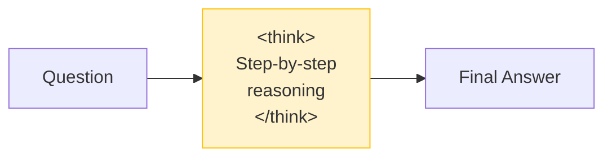

# Chain-of-Thought Reasoning

Enable `<think>` step-by-step reasoning before the final answer. Critical for complex physical reasoning tasks.

!!! tip "Cosmos 3 reasoning"
    `Cosmos3ReasonerModel(reasoning=True)` enables the same explicit `<think>` format on
    the latest omnimodal model. See the [Cosmos 3 Guide](cosmos3.md).

---


## See It In Action


<details>
<summary>📺 Can't see the animation? <a href="/strands-cosmos/assets/videos/03_driving_analysis.mp4">Download MP4</a></summary>

<video controls width="100%" muted>
  <source src="/strands-cosmos/assets/videos/03_driving_analysis.mp4" type="video/mp4">
</video>

</details>

---

## How It Works



When `reasoning=True`, Cosmos generates a reasoning trace wrapped in `<think>...</think>` tags, then provides a concise final answer.

## Enable Chain-of-Thought

```python
from strands import Agent
from strands_cosmos import CosmosVisionModel

model = CosmosVisionModel(
    model_id="nvidia/Cosmos-Reason2-2B",
    reasoning=True,  # ← This enables CoT
    params={"temperature": 0.6},
)
agent = Agent(model=model)
```

→ [Full driving analysis example with CoT](../examples/driving.md)

## Example Output

```
<think>
I can see a residential street with parked cars on both sides.
There is a crosswalk ahead with a pedestrian waiting to cross.
The traffic light appears to be green for the ego vehicle.
However, the pedestrian might step onto the road.
The recommended action is to slow down and prepare to yield.
</think>

The driver should slow down approaching the crosswalk and be
prepared to yield to the pedestrian on the right.
```

## When to Use Reasoning

| Scenario | `reasoning=` | Why |
|----------|-------------|-----|
| Quick captions | `False` | Speed matters |
| Safety analysis | `True` | Need thorough analysis |
| Robot planning | `True` | Multi-step planning |
| Video descriptions | `False` | Direct description |
| Physics reasoning | `True` | Logical chain needed |

## Performance Impact

Reasoning increases output length and inference time:

| Mode | Typical Tokens | Inference Time (2B) |
|------|---------------|---------------------|
| Direct (`reasoning=False`) | 100–500 | 5–15s |
| CoT (`reasoning=True`) | 500–2000 | 15–55s |

!!! tip "Temperature for reasoning"
    Use `temperature=0.6` with reasoning enabled. Lower values produce more focused chains, higher values explore more possibilities.

## Robot Embodied Reasoning with CoT


```python
model = CosmosVisionModel(
    model_id="nvidia/Cosmos-Reason2-2B",
    reasoning=True,
)
agent = Agent(model=model)

agent("<image>robot_workspace.png</image> What is the next action?")
```

→ [Full embodied reasoning example](../examples/embodied.md)

---

## What's Next

- [**Video Understanding**](video-understanding.md) — Apply CoT to video analysis
- [**Tool Usage**](tool-usage.md) — Use reasoning in multi-agent setups
