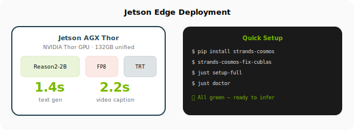
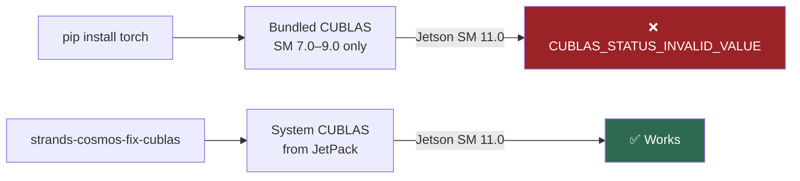
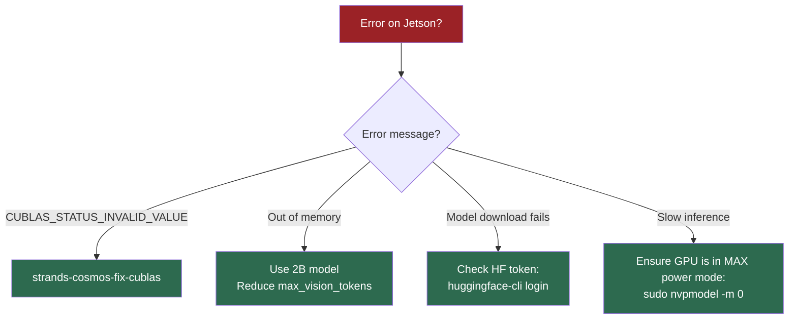

# Jetson Deployment

Run Cosmos-Reason2 on NVIDIA Jetson edge devices (AGX Thor, Orin).

---




## Performance on Jetson AGX Thor

<div class="grid cards" markdown>

- **⚛️ Text-Only Physics (~11s)**

    

- **🚗 Driving Analysis + CoT (~16s)**

    

</div>

All recordings above were captured on Jetson AGX Thor with 132GB unified memory.

---

## Supported Jetson Devices

| Device | GPU Memory | Model | Status |
|--------|-----------|-------|--------|
| Jetson AGX Thor | 132 GB | 2B + 8B | ✅ |
| Jetson AGX Orin 64 | 64 GB | 2B + 8B | ✅ |
| Jetson AGX Orin 32 | 32 GB | 2B | ✅ |
| Jetson Orin NX 16 | 16 GB | ❌ | Not enough memory |

## Setup

```bash
# 1. Install
pip install strands-cosmos

# 2. Fix CUBLAS (required for Jetson)
strands-cosmos-fix-cublas
```

## The CUBLAS Problem

PyTorch wheels bundle their own `libcublas.so` which doesn't support Jetson GPU architectures:

- **Thor:** SM 11.0 — not in pip torch's CUBLAS
- **Orin:** SM 8.7 — may not be in pip torch's CUBLAS

**Symptom:** `CUBLAS_STATUS_INVALID_VALUE` on any matrix operation.



## Fix Commands

```bash
# Auto-detect and fix
strands-cosmos-fix-cublas

# Check status without fixing
strands-cosmos-fix-cublas --check

# Revert to original
strands-cosmos-fix-cublas --revert
```

### What the Fix Does

1. Backs up torch's bundled `libcublas.so` and `libcublasLt.so`
2. Copies system CUBLAS from JetPack (`/usr/local/cuda/targets/*/lib/`)
3. Verifies with a quick `torch.mm` test

!!! warning "Run after every torch upgrade"
    If you upgrade PyTorch, re-run `strands-cosmos-fix-cublas` — the new torch will overwrite the fix.

## Benchmarks (Cosmos-Reason2-2B on Thor)

| Task | Time | Recording |
|------|------|-----------|
| Text-only physics | ~11s | [:material-play: cast](../assets/casts/01_basic_text.cast) |
| Video caption (10s @ 4fps) | ~15s | [:material-play: cast](../assets/casts/02_video_caption.cast) |
| Driving analysis + CoT | ~16s | [:material-play: cast](../assets/casts/03_driving_analysis.cast) |
| Embodied reasoning + CoT | ~43s | [:material-play: cast](../assets/casts/04_embodied_reasoning.cast) |
| Tool invocation | ~9s | [:material-play: cast](../assets/casts/05_tool_usage.cast) |

## Troubleshooting



---

## What's Next

- [**Quickstart**](../getting-started/quickstart.md) — Run your first agent
- [**Video Understanding**](video-understanding.md) — Process video on Jetson
- [**Examples**](../examples/overview.md) — All runnable examples with recordings
