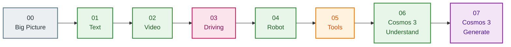

# 📓 Interactive Notebooks

The fastest, friendliest way to learn Strands Cosmos. **Eight short notebooks** take you from
*"what is this?"* all the way to *generating video with sound* — each explained simply, with
**color-coded diagrams**, and **safe to run even without a GPU** (heavy cells skip politely
instead of crashing).

!!! tip "Start here"
    New to Strands Cosmos? Open **`notebooks/00_start_here.ipynb`** first — it's a 5-minute map
    of the whole toolkit, no GPU required.

---

## The learning path



<span style="color:#388E3C">🟢 understanding</span> ·
<span style="color:#D81B60">🧠 step-by-step thinking</span> ·
<span style="color:#F57C00">🟠 tools</span> ·
<span style="color:#8E24AA">🟣 generation</span>

---

## What's inside

| # | Notebook | You'll learn | Needs |
|---|----------|--------------|-------|
| 00 | **Start Here** | The big picture — two model families, one simple tag | — |
| 01 | **Basic Text** | Build an agent in 3 lines; ask physics questions | GPU* |
| 02 | **Video Caption** | Give the agent eyes with `<video>` | GPU* |
| 03 | **Driving Analysis** | Chain-of-thought (`reasoning=True`) for safety | GPU* |
| 04 | **Embodied Reasoning** | Robot next-action from an `<image>` | GPU* |
| 05 | **Tool Usage** | Cosmos as composable tools (many need **no GPU**) | partial |
| 06 | **Cosmos 3: Understand** | The newest reasoner via a vLLM server | GPU + server |
| 07 | **Cosmos 3: Generate** | Create image / video / video+sound | big GPU |

\* *No GPU? You can still run every notebook — the compute cells detect your hardware and skip
with a friendly message.*

---

## Run them locally

We use [`uv`](https://docs.astral.sh/uv/) everywhere:

```bash
uv pip install strands-cosmos jupyter
jupyter lab          # then open notebooks/00_start_here.ipynb
```

The Cosmos 3 notebooks (06, 07) need their backends built once:

```bash
just c3-doctor                                 # check GPU / CUDA / disk
just c3-setup-reason && just c3-serve-reason   # notebook 06 (server on :8000)
just c3-setup-gen                              # notebook 07 (in-process Diffusers)
```

---

## Notebooks vs. Examples

Every notebook has a matching **runnable script** in the
[`examples/`](https://github.com/cagataycali/strands-cosmos/tree/main/examples) folder. The
notebook *teaches* the concept step by step; the script is the *copy-paste-ready* version.

→ Browse them on GitHub:
**[`notebooks/`](https://github.com/cagataycali/strands-cosmos/tree/main/notebooks)** ·
**[`examples/`](https://github.com/cagataycali/strands-cosmos/tree/main/examples)**
