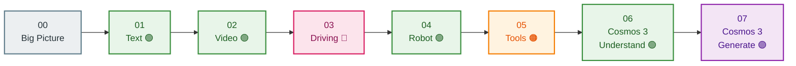

# 📓 Strands Cosmos Notebooks

**The friendliest way to learn Strands Cosmos.** Eight short, runnable notebooks that take you
from *"what is this?"* to *generating video with sound* — explained simply, with color-coded
diagrams, and **safe to run even without a GPU** (heavy cells skip politely).

> New here? **Open [`00_start_here.ipynb`](00_start_here.ipynb) first.** It's a 5-minute map of
> the whole toolkit.

---

## The learning path



🟢 understanding · 🧠 step-by-step thinking · 🟠 tools · 🟣 generation

---

## The notebooks

| # | Notebook | You'll learn | Needs |
|---|----------|--------------|-------|
| 00 | [Start Here](00_start_here.ipynb) | The big picture — two model families, one simple tag | — |
| 01 | [Basic Text](01_basic_text.ipynb) | Build an agent in 3 lines; ask physics questions | GPU* |
| 02 | [Video Caption](02_video_caption.ipynb) | Give the agent eyes with `<video>` | GPU* |
| 03 | [Driving Analysis](03_driving_analysis.ipynb) | Chain-of-thought (`reasoning=True`) for safety | GPU* |
| 04 | [Embodied Reasoning](04_embodied_reasoning.ipynb) | Robot next-action from an `<image>` | GPU* |
| 05 | [Tool Usage](05_tool_usage.ipynb) | Cosmos as composable tools (many need **no GPU**) | partial |
| 06 | [Cosmos 3: Understand](06_cosmos3_understand.ipynb) | The newest reasoner via a vLLM server | GPU + server |
| 07 | [Cosmos 3: Generate](07_cosmos3_generate.ipynb) | Create image / video / video+sound | big GPU |

\* *No GPU? You can still read and run every notebook — the compute cells detect the hardware
and skip with a friendly message instead of crashing.*

---

## Run them

We use [`uv`](https://docs.astral.sh/uv/) everywhere:

```bash
uv pip install strands-cosmos jupyter
jupyter lab          # then open notebooks/00_start_here.ipynb
```

The Cosmos 3 notebooks (06, 07) need their backends built once:

```bash
just c3-doctor                              # check GPU / CUDA / disk
just c3-setup-reason && just c3-serve-reason   # for notebook 06 (server on :8000)
just c3-setup-gen                              # for notebook 07 (in-process Diffusers)
```

---

## Each notebook backs a script

Every notebook has a matching runnable script in [`../examples`](../examples). The notebook
**teaches** the concept; the script is the **copy-paste-ready** version.

| Notebook | Script |
|----------|--------|
| 01–05 | `examples/01`–`05_*.py` (same numbers) |
| 06 | `examples/06_cosmos3_reason.py` |
| 07 | `examples/07_cosmos3_generate.py` |
| (advanced) | `examples/08_cosmos3_action.py`, `09_cosmos3_showcase.py`, `10_cosmos3_finetune.py` |

> **A note on file access:** Cosmos tools confine reads/writes to a workspace allow-list for
> safety. The notebooks set `COSMOS_WORKSPACE` to the project root + `/tmp` so the bundled
> `sample.mp4` / `sample.png` are reachable. Point it elsewhere to grant access to your own
> folders — never wider than you need.
